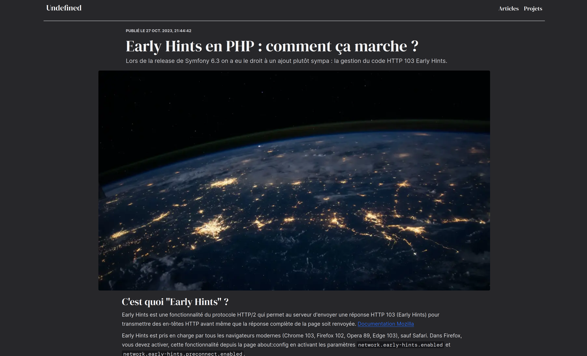

# Project behind www.udfn.fr

**Sandbox project used to try some stuffs and made good code (_I believe_) on my free time.**

See my blog : [www.udfn.fr](https://www.udfn.fr)

## Documentation

**Documentation is available in docs folder or with [Docsify](https://docsify.js.org) in this
webpage : [adrien-chinour.github.io/blog.](https://adrien-chinour.github.io/blog/)**
