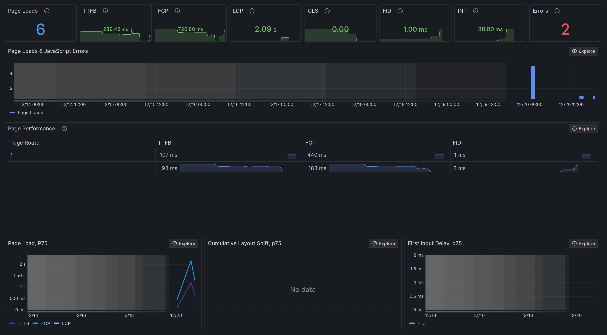

[](https://sonarcloud.io/summary/new_code?id=adrien-chinour_blog)
[](https://sonarcloud.io/summary/new_code?id=adrien-chinour_blog)
[](https://sonarcloud.io/summary/new_code?id=adrien-chinour_blog)

# Installation 🔧

```sh
# Create .env.local file
cp .env .env.local

# Put values on missing environnements variables
nano .env.local

# Build application container and install dependencies (composer & npm)
make install

# Build assets
make npm c="run dev"

# Or with hot-reloading
make watch
```

# Roadmap 🗺️

- Add Webhook support on Contentful
- Add Comment system on Articles
- Add tag pages
- _(Add more tests)_

# Project Architecture 🏗️


## Overview

> TODO make a schema about project architecture

## Coding standards

### Git

Commit **MUST** respect [Conventional Commits specifications](https://www.conventionalcommits.org/en/v1.0.0/) 

Allowed types are : 
- **feat** – a new feature is introduced with the changes
- **fix** – a bug fix has occurred
- **chore** – changes that do not relate to a fix or feature and don't modify src or test files (for example updating dependencies)
- **refactor** – refactored code that neither fixes a bug nor adds a feature
- **docs** – updates to documentation such as a the README or other markdown files
- **style** – changes that do not affect the meaning of the code, likely related to code formatting such as white-space, missing semi-colons, and so on.
- **test** – including new or correcting previous tests
- **perf** – performance improvements
- **ci** – continuous integration related
- **build** – changes that affect the build system or external dependencies
- **revert** – reverts a previous commit 

## Layers

Project not use default Symfony structure but use a multi layer organisation. These layers are :

- **Domain** : contain business logic, in our case Models and Repositories Interface.
- **Infrastructure** : make link with framework (Symfony) and External services (Contentful, GitHub, etc.).
- **Application** : define actions on application, implement CQRS pattern.
- **UI** : in charge of http request/response handling.

> See [Domain-driven design](https://en.wikipedia.org/wiki/Domain-driven_design).

# Query/Command Bus 🚌

Application Layer of project use the [CQRS](https://en.wikipedia.org/wiki/Command_Query_Responsibility_Segregation)
architecture pattern.

Implementation is made with [Symfony Messenger](https://symfony.com/doc/current/components/messenger.html) using the
default `sync` Transport for Query and Command.

> **✨ Improvement** : Use an async Transport for Command.

## Query Caching

Using `CacheableQueryInterface` on query allow to cache query result.

For exemple, `GetArticleQuery` is cached for 1h _(60 * 60 = 3600)_.

```php
final readonly class GetArticleQuery implements CacheableQueryInterface
{
    public function __construct(public string $identifier, public bool $preview = false) {}

    public function getCacheKey(): string
    {
        return sprintf('article_%s', $this->identifier);
    }

    public function getCacheTtl(): int
    {
        return $this->preview ? 0 : 3600;
    }
}
```

- `getCacheKey` : key used in cache system to store query result.
- `getCacheTtl` : time-to-live for cache entry in seconds.

> **✨ Improvement** : Use an attribute instead of interface for cache metadata.

## Cache invalidation

```shell
curl -H "Authorization: Bearer {{token}} https://www.udfn.fr/admin/cache-invalidation?cacheKey={{cacheKey}}
```

Cache can be purged from `/admin/cache-invalidation` with `cacheKey` defined in query.

> Routes from /admin/* need a security token to be accessed : see [admin section](#Secure-routes)

# Frontend 🌐

## Components & Controller

## Turbo

Page rendering use [Turbo Stream](https://turbo.hotwired.dev/handbook/streams) to render content. This will
fetch HTML content with Javascript without re-rendering all the document.

Integration is made with [Symfony UX](https://ux.symfony.com/turbo) with
a [Stimulus Controller](https://stimulus.hotwired.dev/).

Rendering a new page will no longer trigger Javascript reloading. If you need to trigger Javascript on every page you
will need to listen
on [Turbo Events](https://turbo.hotwired.dev/handbook/building#observing-navigation-events) : `turbo:load`.

# Security 👮

## Rate Limiter

This app use Symfony RateLimiter component to prevent too many request. Limiter is configured like this :

```php
// framework.php

$framework->rateLimiter()
    ->limiter('public')
    ->policy('sliding_window')
    ->limit(1000)
    ->interval('60 minutes')
;
```

> RateLimiter component documentation : https://symfony.com/doc/current/rate_limiter.html

Limit is not a number of request but a number of token consumed using these rules :

| action       | consume    |
|--------------|------------|
| any request  | 1 token    |
| 404 response | 5 tokens   |
| 400 response | 10 tokens  |
| 403 response | 10 tokens  |
| 405 response | 10 tokens  |
| 401 response | 100 tokens |

Implementation of token consumption is in `App\Infrastructure\Symfony\EventListener\RateLimiterEventListener`. This
event listener listen on Symfony HttpKernel `RequestEvent` and `ResponseEvent`.

The idea behind this strategy is to prevent random discovery bot. For exemple, bots can only crawl around 165 url in 1
hour, if all crawled page are 404. Only 10, if all page need authentication.

2 headers is available on response :

- `X-RateLimit-Limit` number of available token.
- `X-RateLimit-Remaining` : number of remaining tokens

> rate limit is store using default Symfony cache (filesystem). It will be reset on every new app deployment.

## Secure routes

Accessing routes under `^/(admin|webhook)` is available with authentication. Security is configured under Symfony
SecurityBundle in `config/security.php`.

There is no user database, it used _in memory_ provider with a default admin user with ROLE_ADMIN. Authentication
use `Symfony\Component\Security\Http\Authenticator\AccessTokenAuthenticator`
and `App\Infrastructure\Symfony\Security\AccessTokenHandler`.

**Usage (send a cache invalidation request):**

```shell
curl -H "Authorization: Bearer {{token}}" https://www.udfn.fr/admin/cache-invalidation?cacheKey=articles
```

> 3 bad login attempt will ban IP for 1 hour. (Configuration from SecurityBundle using RateLimiter component).
> See documentation : https://symfony.com/doc/current/security.html#limiting-login-attempts

# Testing 🧪

## Performance Testing with Grafana k6

Grafana k6 is a load testing tool. See the documentation : https://grafana.com/docs/k6/latest/

Performance testing is not in main CI workflows and can be launch directly from GitHub Actions :
https://github.com/adrien-chinour/blog/actions/workflows/loadsuite.yaml

## PHP Test with Pest

> TODO

## Javascript Test with Jest

> TODO

# Analytics 📊

Website traffic analytics is made using Countly (self-hosted) :
> #1 privacy-centric product analytics solution providing insights into how your users interact with your digital
> products, from acquisition to advocacy.

Integration is made on `analytics.js` :

```javascript
import Countly from 'countly-sdk-web'

window.addEventListener('turbo:load', () => {
    Countly.init({
        app_key: '8696ce4d4dfb160bb24351cb04ae16be868501f6',
        url: 'https://countly.chinour.dev',
        debug: process.env.NODE_ENV !== 'production',
    });

    // Enable tracking
    Countly.track_sessions();
    Countly.track_pageview();
    Countly.track_errors();

});
```

Analytics is loaded on turbo:load event (see [Turbo](#turbo)).

> CORS is handled by `App\Infrastructure\Symfony\EventListener\CorsEventListener`.

## Analytics Events

For custom tracking event Countly has a prebuild
system (https://support.count.ly/hc/en-us/articles/360037441932-Web-analytics-JavaScript-#h_01HABTQ4372MVVDDTW1FWVFJXF).

For exemple on `analytics.js` :

```javascript
// User click on any article suggestion at the end of article
document.querySelectorAll('.analytics-suggestions').forEach((link) => {
    link.addEventListener('click', () => {
        console.debug('Suggestion click');
        Countly.q.push(['add_event', {key: 'suggestion_click'}]);
    })
});
```

Convention is to use `.analytics-{event-name}` for query selector of target element. Then, send this event with data
to Countly.

# Observability 🔭

## Frontend observability using Grafana Faro



[Grafana Faro](https://grafana.com/oss/faro/) is an OSS Project for Frontend application Observability.

The project provide Javascript librairies to integrate all frontend metrics and logs (including Errors) directly on
Grafana.

Integration is made on `observability.js` :

```js
import {getWebInstrumentations, initializeFaro} from '@grafana/faro-web-sdk';
import {TracingInstrumentation} from '@grafana/faro-web-tracing';

if (process.env.NODE_ENV === 'production') {
    initializeFaro({
        url: 'https://faro-collector-prod-eu-west-0.grafana.net/collect/9689c3ba5a20d52b36dec6a5da24f8eb',
        app: {
            name: 'udfn.fr',
            version: '1.0.0',
            environment: 'production'
        },
        instrumentations: [
            ...getWebInstrumentations(),
            new TracingInstrumentation(),
        ],
    });
}
```

> Faro is only initialize on **production** environnement.

# CI/CD ‍🔄

All CI/CD pipeline is made with GitHub Actions. As defined in specification workflows are defined in `.github/workflows`
folder.

Two workflows is defined :

- `quality.yaml` is the continuous integration workflow. It install and validate composer dependencies, then run quality
  checks like PHPStan, ECS, Pest test suites and k6 load tests.
- `release.yaml` is the Continuous deployment workflow. Il will be trigger when quality workflow succeed on `main`
  branch. The release is basically a call to DigitalOcean Build & Deploy pipeline.
- `loadsuite.yaml` allow to start k6 test suite manually from GitHub Actions
